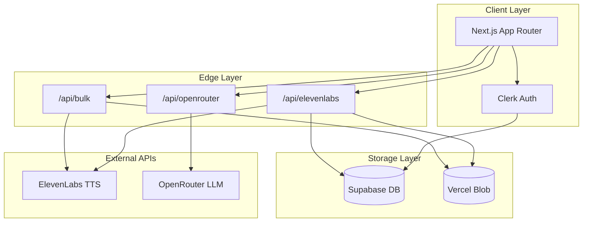

# ElevenTools v2: Next.js Migration Plan

## Overview

Rebuild ElevenTools as a developer-focused Next.js application for bulk text-to-speech generation with personalization and translation capabilities. The new architecture will use Edge Functions for low-latency API calls, Supabase for user data persistence, and Vercel Blob for audio file storage.

## Tech Stack

| Layer | Technology |

|-------|------------|

| Framework | Next.js 15 (App Router) |

| Package Manager | Bun |

| UI Components | shadcn/ui + Tailwind CSS |

| Authentication | Clerk (full auth with user accounts) |

| Database | Supabase (PostgreSQL) |

| File Storage | Vercel Blob |

| API Layer | Edge Functions (Vercel Edge Runtime) |

| Deployment | Vercel |

## Architecture



## Core Features

### 1. Bulk Generation with Personalization

- CSV upload with variable columns (e.g., `{name}`, `{company}`, `{product}`)
- Template text with variable placeholders
- Batch processing with progress tracking
- Parallel generation for speed
- Download as ZIP or individual files

### 2. Translation Pipeline

- Pre-TTS translation via OpenRouter
- Model selection with fuzzy search and free-model filtering
- Language detection and target language selection
- Batch translation before bulk generation

### 3. User Dashboard

- Saved API keys (encrypted in Supabase)
- Generation history with audio playback
- Usage statistics
- Project/batch organization

### 4. Developer Experience

- Dark theme with monospace accents (Linear/Vercel aesthetic)
- Keyboard shortcuts for power users
- JSON/API response previews
- Export generation configs

## Database Schema (Supabase)

```sql
-- Users table (synced from Clerk)
users (
  id UUID PRIMARY KEY,
  clerk_id TEXT UNIQUE,
  email TEXT,
  created_at TIMESTAMP
)

-- Encrypted API keys per user
api_keys (
  id UUID PRIMARY KEY,
  user_id UUID REFERENCES users,
  service TEXT, -- 'elevenlabs' | 'openrouter'
  encrypted_key TEXT,
  created_at TIMESTAMP
)

-- Generation history
generations (
  id UUID PRIMARY KEY,
  user_id UUID REFERENCES users,
  batch_id UUID,
  text TEXT,
  voice_id TEXT,
  model_id TEXT,
  blob_url TEXT,
  created_at TIMESTAMP
)
```

## Project Structure

```
/
├── app/
│   ├── (auth)/
│   │   ├── sign-in/
│   │   └── sign-up/
│   ├── (dashboard)/
│   │   ├── bulk/
│   │   ├── translate/
│   │   ├── history/
│   │   └── settings/
│   ├── api/
│   │   ├── elevenlabs/
│   │   ├── openrouter/
│   │   ├── bulk/
│   │   └── webhooks/clerk/
│   ├── layout.tsx
│   └── page.tsx
├── components/
│   ├── ui/ (shadcn)
│   ├── bulk-generator/
│   ├── translation/
│   └── audio-player/
├── lib/
│   ├── supabase/
│   ├── elevenlabs/
│   ├── openrouter/
│   └── utils/
├── .env.local
├── package.json
└── tailwind.config.ts
```

## Implementation Phases

### Phase 1: Foundation (Days 1-2)

- Initialize Next.js 15 project with Bun
- Configure Clerk authentication
- Set up Supabase database and schema
- Install and configure shadcn/ui with dark theme
- Create base layout with navigation

### Phase 2: Core API Layer (Days 3-4)

- ElevenLabs Edge API routes (voices, models, generate)
- OpenRouter Edge API routes (models, translate)
- Supabase integration for API key storage
- Vercel Blob integration for audio storage

### Phase 3: Bulk Generation (Days 5-7)

- CSV upload and parsing component
- Variable detection and template preview
- Batch processing with progress UI
- Audio preview and download functionality
- ZIP export for bulk downloads

### Phase 4: Translation (Days 8-9)

- Translation page with model selection
- Batch translation before TTS
- Language detection integration
- Translation + TTS pipeline

### Phase 5: Polish (Days 10-11)

- Generation history page
- Settings page with API key management
- Dark theme refinement
- Keyboard shortcuts
- Error handling and loading states

## Key Files to Reference

From the current Streamlit app:

- [`scripts/Elevenlabs_functions.py`](scripts/Elevenlabs_functions.py) - ElevenLabs API integration
- [`scripts/openrouter_functions.py`](scripts/openrouter_functions.py) - OpenRouter API integration
- [`scripts/functions.py`](scripts/functions.py) - Variable detection, phonetic conversion
- [`pages/bulk_generation.py`](pages/bulk_generation.py) - Bulk processing logic
- [`pages/translation.py`](pages/translation.py) - Translation flow

## Branch Strategy

Work will be done on a new branch `eleventools-v2` to preserve the Streamlit app while building the Next.js version.

## Getting Started Commands

```bash
# Create and switch to new branch
git checkout -b eleventools-v2

# Initialize Next.js with Bun
bunx create-next-app@latest . --typescript --tailwind --eslint --app --src-dir=false

# Install core dependencies
bun add @clerk/nextjs @supabase/supabase-js @vercel/blob
bun add lucide-react class-variance-authority clsx tailwind-merge

# Initialize shadcn/ui
bunx shadcn@latest init
```