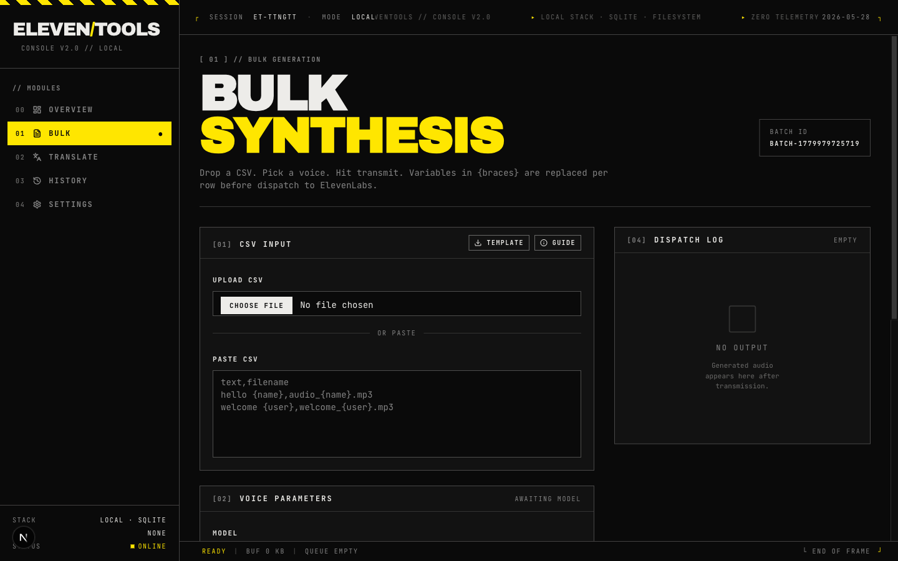

<div align="center">

# ElevenTools

**A local-first command console for ElevenLabs — bulk TTS, multi-speaker v3 dialogue, and translation, all running on your own machine.**

[](https://nextjs.org)
[](https://react.dev)
[](https://www.typescriptlang.org)
[](https://tailwindcss.com)
[](https://www.sqlite.org)
[](https://elevenlabs.io)
[](./LICENSE)



</div>

---

## Why

ElevenLabs' web app is great for one-offs. It is painful when you need to render two hundred personalised voicemail drops, prototype a podcast intro with three speakers and a `[whispers]` audio tag, or translate a script before voicing it — without leaving fingerprints in a third-party dashboard.

ElevenTools is an opinionated **operator's console** for those jobs. It runs entirely on your machine, stores nothing in the cloud, and exposes the API surface the official UI quietly hides — prosody continuity across batches, v3 dialogue mode, deterministic seeds, ten output formats, and audio tags.

## Features

### Bulk generation
- Drag-drop or paste **CSV** with auto-detected `{variable}` placeholders
- Per-row filename overrides, voice-settings panel (stability / similarity / style / speed / seed)
- **Ten output formats** (mp3 at four bitrates, pcm at five sample rates, μ-law 8kHz)
- **Prosody continuity** across the batch via a rolling buffer of the last three `previousRequestIds` — your hundred-row run sounds like one performance, not a hundred jump-cuts
- Streaming dispatch log with inline audio players and per-row success/failure tracking
- Downloadable `bulk_template.csv` baked into the upload UI

### Multi-speaker dialogue (ElevenLabs v3)
- Compose up to **20 lines × 10 unique voices × 2,000 characters**
- Per-line voice assignment with live character/voice budget
- **Audio tag picker** for v3 expressive cues: `[whispers] [laughs] [sighs] [excited] [curious] [sarcastic] [interrupting] [hesitates] [footsteps] [applause]`
- Cursor-aware insertion so tags land where you mean them to

### Translation
- OpenRouter front-end with fuzzy model search and free-tier filter
- Translate scripts before voicing them; preserves variable placeholders
- Default model persisted per operator

### History & archive
- Every generation hits local SQLite (`generations` table) and the filesystem (`data/audio/`)
- Browse by batch ID, audition inline, download, purge
- Path-traversal-protected static audio serving

### Operator settings
- Default translation model, default enhancement model
- Persists to SQLite — no cloud round-trip

## Stack

| Layer | Choice | Why |
|---|---|---|
| Framework | **Next.js 15** (App Router) + **React 19** | Server components for the API surface, RSC-friendly streaming |
| Language | **TypeScript 5.3** (strict) | Catches the camelCase ↔ snake_case mistakes the ElevenLabs SDK loves to make |
| UI | **Tailwind 3.4** + **shadcn/ui** (new-york) + **Radix** + **Lucide** | Brutalist console aesthetic over accessible primitives |
| Data | **SQLite** via `better-sqlite3` (WAL mode, FK on) | Zero-config, single-file, idempotent migrations |
| Storage | Local filesystem (`data/audio/`) | Your audio. Your disk. Nobody else's. |
| Auth | **None** | Local-first. The threat model is "the laptop is yours." |
| AI | **`@elevenlabs/elevenlabs-js` 2.49** (TTS + dialogue), **OpenRouter** (translation), **Vercel AI SDK** (LLM wrapper) | First-party SDK; OpenRouter for free model access |
| Tests | **Vitest** (unit) + **Playwright** (e2e, Chromium) | Unit for capability matrices and CSV parsing, Playwright for the bulk happy path |
| Pkg mgr | **pnpm** | Required — `better-sqlite3` is a native module |

## Architecture at a glance

```
┌─────────────────────────────────────────────────────────┐
│  Next.js App Router                                     │
│                                                         │
│  app/(dashboard)/                ──►  React 19 + RSC    │
│    bulk, dialogue, translate,                           │
│    history, settings                                    │
│                                                         │
│  app/api/                                               │
│    elevenlabs/{models,voices,dialogue}                  │
│    openrouter/{models,translate}                        │
│    bulk/generate    ──►  prosody-stitched batches       │
│    audio/[...path]  ──►  hardened static serve          │
│    history, settings/defaults                           │
└─────────────────────────────────────────────────────────┘
                         │
        ┌────────────────┼────────────────┐
        ▼                ▼                ▼
   SQLite WAL      data/audio/*       ElevenLabs API
   generations     local MP3/PCM      (v2 TTS + v3 dialogue)
   settings
                                      OpenRouter API
                                      (translation)
```

## Quickstart

### Prerequisites
- **Node.js 18+** (or Bun — but `pnpm` is recommended because `better-sqlite3` is a native build)
- **pnpm** (`npm i -g pnpm`)
- An **ElevenLabs API key** ([get one](https://elevenlabs.io/app/settings/api-keys))
- _(optional)_ An **OpenRouter API key** for translation ([get one](https://openrouter.ai/keys))

### Install & run

```bash
git clone https://github.com/manuelthomsen/ElevenTools.git
cd ElevenTools
pnpm install

# configure
cat > .env.local <<'EOF'
ELEVENLABS_API_KEY=sk_...
OPENROUTER_API_KEY=sk-or-...     # optional, only for /dashboard/translate
# ELEVENTOOLS_DB_PATH=./data/eleventools.db
# ELEVENTOOLS_AUDIO_PATH=./data/audio
EOF

pnpm dev
# open http://localhost:3000 → redirects to /dashboard
```

The SQLite database and `data/audio/` directory are created on first write. Both paths are overridable via env.

## Scripts

| Script | What it does |
|---|---|
| `pnpm dev` | Next.js dev server |
| `pnpm build` | Production build |
| `pnpm start` | Production server |
| `pnpm lint` | ESLint |
| `pnpm test` | Vitest — unit tests, single run |
| `pnpm test:watch` | Vitest in watch mode |
| `pnpm test:e2e` | Playwright — bulk page smoke test on port 3100 |

## Project layout

```
app/
  (dashboard)/dashboard/      bulk · dialogue · translate · history · settings
  api/                        elevenlabs · openrouter · bulk · audio · history · settings
  layout.tsx · page.tsx · globals.css

components/
  bulk-generator/             csv-upload · audio-tag-picker
  ui/                         shadcn primitives
  sidebar.tsx · model-selector.tsx · ASCIIText.jsx

lib/
  db.ts                       SQLite singleton, idempotent migrations
  storage.ts                  filesystem audio paths
  elevenlabs/{api,types}.ts   SDK wrapper, SDK-free type aliases
  openrouter/api.ts           translation + model search
  utils/                      csv · model-capabilities · text-processing

tests/
  unit/                       Vitest
  e2e/                        Playwright (stubs ELEVENLABS_API_KEY)

data/                         SQLite DB + generated audio (gitignored)
public/bulk_template.csv      downloadable demo CSV
guides/                       ElevenLabs TTS / v3 reference notes
```

## API surface

| Route | Method | Purpose |
|---|---|---|
| `/api/elevenlabs/models` | `GET` | List TTS models |
| `/api/elevenlabs/voices` | `GET` | List voices |
| `/api/elevenlabs/voices/[voiceId]` | `GET` | Single voice |
| `/api/elevenlabs/dialogue` | `POST` | v3 multi-speaker dialogue |
| `/api/openrouter/models` | `GET` | LLM catalog (`?freeOnly=true`, `?search=…`) |
| `/api/openrouter/translate` | `POST` | LLM-backed translation |
| `/api/bulk/generate` | `POST` | Batch TTS with prosody continuity |
| `/api/history` | `GET` / `DELETE` | Browse / purge generations |
| `/api/settings/defaults` | `GET` / `POST` | Operator preferences |
| `/api/audio/[...path]` | `GET` | Path-traversal-safe audio serving |

## Design notes

- **Brutalist console aesthetic** — monospace everywhere, hazard bands, `[XX]` panel codes, blinking status dots, zero-padded indices. Built on shadcn/ui so the bones stay accessible.
- **No auth, no telemetry, no cloud database.** If you can run a local dev server, you can run ElevenTools.
- **Camera-ready snake_case mapping.** The ElevenLabs JS SDK uses camelCase; the local schema is snake_case. The mapping happens at the wrapper boundary in `lib/elevenlabs/api.ts` so the rest of the app stays consistent.
- **Idempotent SQLite migrations** — schema additions are guarded with `PRAGMA table_info` checks so re-running on an existing DB is safe.

## Testing

```bash
pnpm test           # 18 unit tests covering CSV parsing, capability matrices, mappers
pnpm test:e2e       # Playwright bulk-page smoke with stubbed ElevenLabs API
```

E2E tests stub the ElevenLabs API so they run offline. Unit tests use a `server-only` stub to allow importing server-flagged modules from Vitest.

## Roadmap

- [ ] Script enhancement via Vercel AI SDK `streamText` (v3 audio-tag enrichment for non-dialogue text)
- [ ] WebSocket streaming for low-latency single-utterance preview
- [ ] Voice library import/export (JSON round-trip with `data/voices/`)
- [ ] Pluggable storage backend (S3-compatible) for teams that want to share batches

## Contributing

Issues and PRs welcome. The codebase is small and the conventions live next to the code — read [`CONTRIBUTING.md`](./CONTRIBUTING.md) and the [TTS guide](./guides/elevenlabs_tts_guide.md) before opening a PR.

## License

[MIT](./LICENSE) © 2025 Manuel Thomsen

ElevenTools is an independent open-source project and is not affiliated with, endorsed by, or sponsored by ElevenLabs or OpenRouter.
